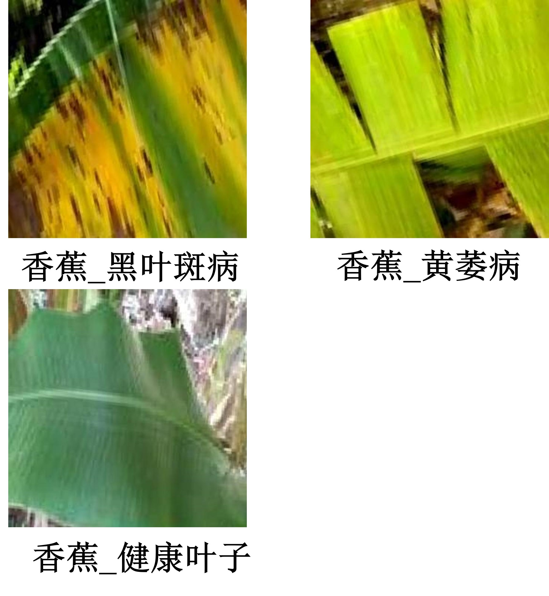
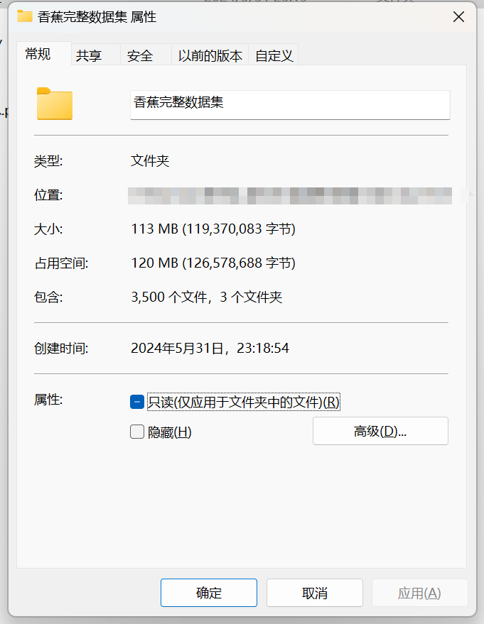
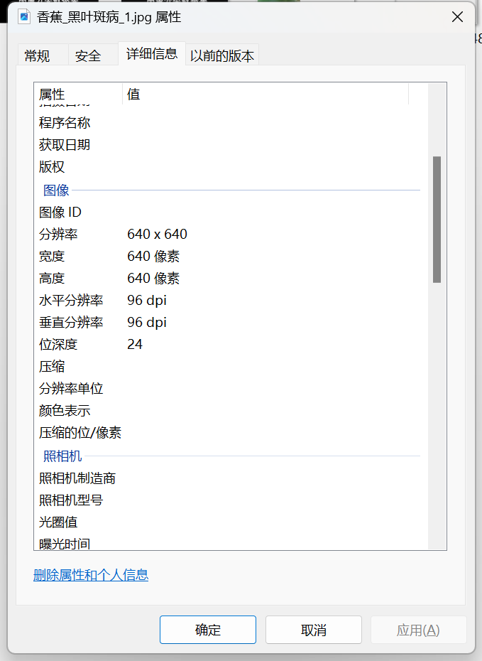

# Banana Leaf Disease Dataset

**Full Dataset Introduction:**
- Number of images in the folder "Banana_Health": 620
- Number of images in the folder "Banana_Yellow Rot": 1600
- Number of images in the folder "Banana_Black Spot": 1280
Total number of images in all subfolders: 3500

**Overall Preview:**

## Images

Here is a pay link on Stripe ( https://buy.stripe.com/3cs8yP7sY87d0vu9AB ). Please contact me lonlonago@foxmail.com after funding $89, and I will send you a complete data files , thank you!

